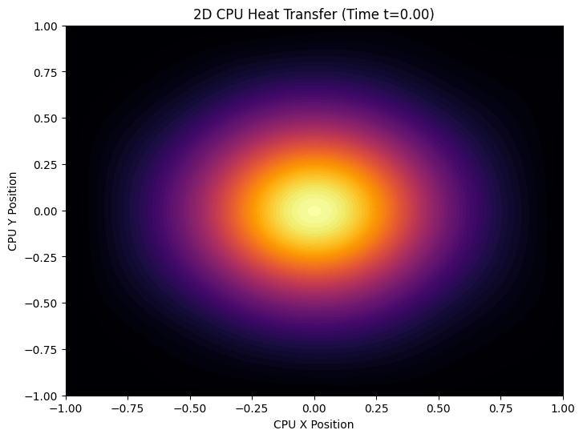
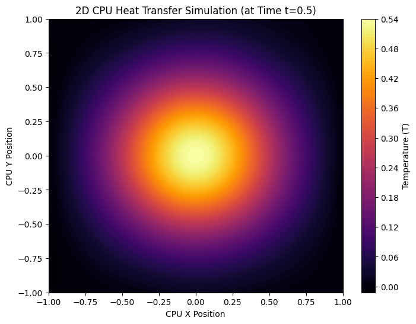
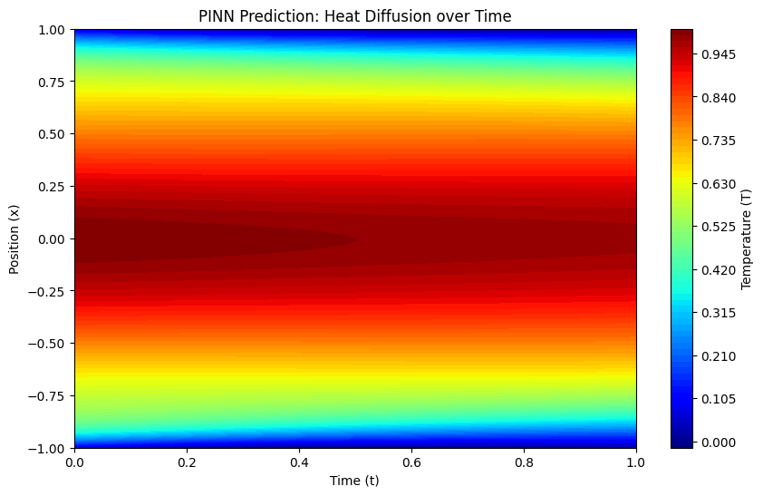

# 🚀 2D CPU Thermal Management Simulation using PINNs

This repository features a **Physics-Informed Neural Network (PINN)** designed to simulate heat diffusion and thermal management on a 2D CPU surface. By integrating physical laws directly into the AI's architecture, this model acts as a continuous solver for complex thermal equations without requiring large pre-existing datasets.

---

## 💡 Overview

In modern hardware engineering, managing the "hotspots" of a processor is critical. This project demonstrates a cutting-edge approach where a Neural Network is constrained by the **2D Heat Equation**. The AI doesn't just guess patterns; it obeys the laws of thermodynamics.

### Key Highlights:
* **Physics-Informed Architecture:** The loss function penalizes deviations from the 2D Heat Equations.
* **Autonomous Learning:** Trained using PyTorch's `Autograd` to calculate spatial and temporal derivatives.
* **Real-World Cooling:** Simulates convective cooling (fan effect) using **Newton's Law of Cooling**.
* **Zero-Data Training:** The model generates its own "physics points" to learn the environment.

---

## 🧮 Governing Equations

The network is optimized to satisfy the following partial differential equation (PDE):

$$\frac{\partial T}{\partial t} = k \left( \frac{\partial^2 T}{\partial x^2} + \frac{\partial^2 T}{\partial y^2} \right) - h(T - T_{env})$$

Where:
- **$T$**: Temperature
- **$k$**: Thermal diffusivity
- **$h$**: Convection/Cooling coefficient
- **$T_{env}$**: Ambient temperature

---

## 📊 Simulation Results

The following visualizations demonstrate the AI's ability to model heat behavior accurately across different stages:

### 1. 2D CPU Surface - Initial Hotspot ($t=0.00$)
The AI models the central hotspot at the moment the CPU begins processing.

*Figure 1: High-temperature central region before diffusion.*

### 2. 2D Heat Transfer with Fan Cooling ($t=0.50$)
As time progresses, heat spreads and is removed by the simulated cooling fan.

*Figure 2: Temperature distribution after diffusion and convective cooling.*

### 3. Spatio-Temporal Heat Diffusion (1D Analysis)
A verification plot showing how heat dissipates from the center over the time dimension.

*Figure 3: Heat diffusion trends over time.*

---

## 🛠️ Tech Stack

* **Language:** Python 3.x
* **Framework:** PyTorch (Neural Networks & Autograd)
* **Visualization:** Matplotlib
* **Processing:** NumPy

---

## 🚀 Getting Started

1. **Clone the repo:**
   ```bash
   git clone [https://github.com/your-username/PINN-CPU-Thermal-Simulation.git](https://github.com/your-username/PINN-CPU-Thermal-Simulation.git)
